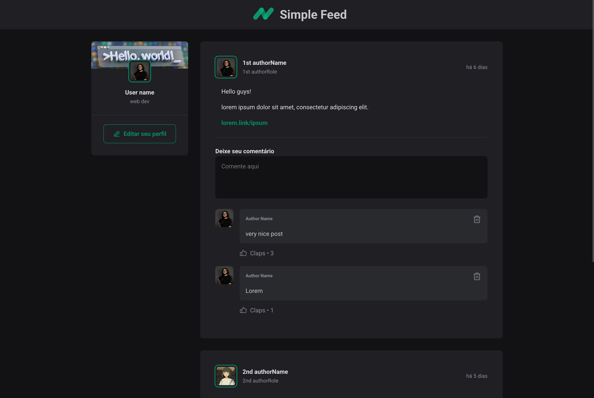

# Simple Feed

A modern social media feed application built with React, TypeScript, and Vite.

 

## Overview

Simple Feed is a React application that displays a social media feed with posts and comments. Users can read posts, view author information, and interact with content through comments.

## Features

- Responsive feed layout with posts
- User profile display with avatars
- Comment system with the ability to add and delete comments
- Date formatting with relative time display
- Modern UI with custom styling

## Project Structure

The application is organized as follows:

- `src/`
  - `App.tsx` - Main application component
  - `global.css` - Global styling
  - `components/`
    - `Post.tsx` - Post component with comment functionality
    - `Header.tsx` - Application header component
    - `Sidebar.tsx` - Sidebar navigation component
    - `Comment.tsx` - Comment component
    - `Avatar.tsx` - User avatar component

  - `assets/` - Logo

## Getting Started

### Prerequisites

- Node.js
- npm package manager

### Installation

1. Clone the repository and cd into directory
2. Run `npm i` to install dependencies
3. Run `npm run dev` to start the development server
4. Open your browser and navigate to the local development server

